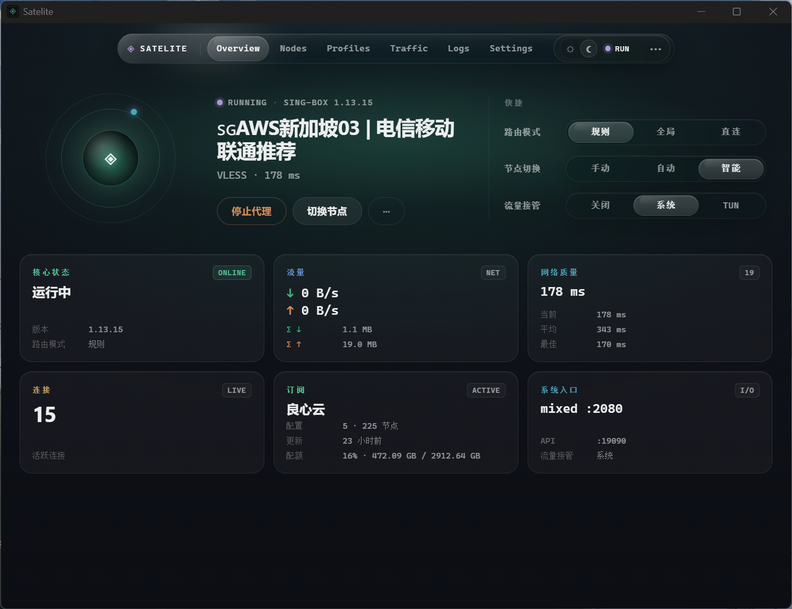
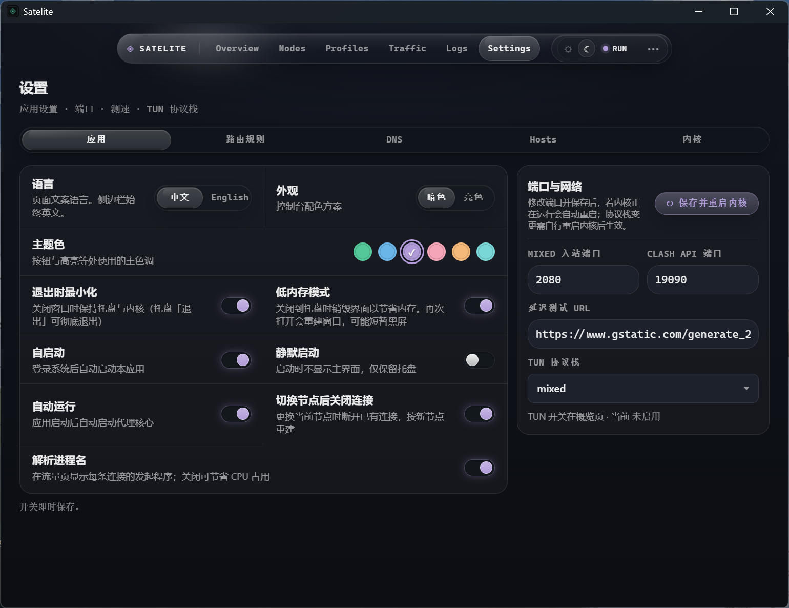

# Satelite

<p align="center">
  <strong>卫星飞天，连接无限。</strong><br/>
  轻量、好看的 <a href="https://github.com/SagerNet/sing-box">sing-box</a> 桌面客户端<br/>
</p>

<p align="center">
  <a href="https://github.com/mashengran2001-prog/satelite-self/stargazers"></a>
  &nbsp;
  
  
  
  
  
</p>

导入订阅、切节点、规则分流、智能 DNS、系统代理 / TUN、托盘常驻——日常该有的都有。  
它**足够轻、足够稳、也足够好看**。

<p align="center">
  <picture>
    <source media="(prefers-color-scheme: dark)" srcset="./assets/banner-dark.png">
    <source media="(prefers-color-scheme: light)" srcset="./assets/banner-light.png">
    
  </picture>
</p>

## 为什么是 Satelite

代理客户端已经够多了。Satelite 不想再做一个「功能清单更长」的壳，而是把 **sing-box** 收成一颗真正能放在桌面上的卫星：

| 你真正在意的 | Satelite 怎么做 |
| --- | --- |
| **体积与内存** | Tauri 2 + Rust，不是 Chromium 全家桶。开着托盘就该被忘掉，而不是占掉半条内存。关到托盘还可选「低内存模式」，把界面卸掉。 |
| **节点会挂** | 三种选路：手动、内核 urltest、应用侧智能切换。智能模式靠连接日志被动感知 + 按需探测，自动避障，而不是一直狂扫全表。 |
| **不想被配置淹没** | 「简洁模式」只留连接 / 节点 / 流量；「专业模式」打开规则、DNS、Hosts、日志。同一套内核，两套节奏。 |
| **界面也是功能** | 玻璃拟态、浅色 / 深色、多种主题色、首页动效三选一（粒子 / 经典 / 笑脸）。打开窗口的那一秒，就该知道这不是 2018 年的后台面板。 |
| **开箱即用** | 内核自动下载更新；Clash 订阅、sing-box JSON、分享链接、`clash://` / `sing-box://` / `singbox://` 浏览器一键导入。 |

> 卫星绕着你转，而不是你围着 YAML 转。

---

## 它能做什么

- **订阅与配置**：Clash 订阅、sing-box JSON、节点分享链接；链接 / 文件 / 浏览器深链导入；订阅可定时更新。也可以把一份完整 sing-box 配置直接当运行时。
- **协议**：SS、VMess、VLESS、Trojan、Hysteria2、TUIC、AnyTLS、SOCKS5 等，一键测速，秒切节点
- **智能选路**：手动 · 应用智能避障 · 内核 urltest，按场景选，不绑死一种策略
- **规则分流**：多规则集（本地 / 远程 `.srs`），拖拽优先级；内置国内站点 / 国内 IP / 海外规则；兜底出口代理 / 直连 / 屏蔽。规则 / 全局 / 直连一键切换
- **DNS 与 Hosts**：DoH / DoT / FakeIP，DNS 规则集、系统 Hosts、默认解析器，还能测解析
- **系统代理 / TUN**：系统代理一键接管；TUN（system / gvisor / mixed）；绕过局域网、可选 TUN IPv6、可拦 QUIC
- **端口**：mixed / Clash API、多监听、允许局域网
- **连接与流量**：活跃连接、已关闭、失败请求、流量走向，自动解析进程名
- **托盘常驻**：关窗进托盘，开机启动、静默启动、可选托盘图标；内核在后台，窗口可消失
- **内核自管**：自动拉取并更新 sing-box，不用自己找二进制、对版本
- **中英双语文案**，浅色 / 深色，多种主题色

<p align="center">
  
  &nbsp;
  
</p>
<p align="center">
  
</p>

## 🖥 平台支持

| 平台            | 状态   |
| --------------- | ------ |
| macOS Apple 芯片 | ✅ 支持 |
| macOS Intel     | ✅ 支持 |
| Windows         | ✅ 支持 |
| Linux           | 🚧 计划中 |

> Satelite Self 仍在持续开发中，升级前请备份重要的配置文件。

## 🛠 技术栈

- **内核**：[sing-box](https://github.com/SagerNet/sing-box)
- **桌面框架**：[Tauri 2](https://tauri.app/)
- **前端**：React + TypeScript + Vite
- **后端**：Rust

## 📦 开发

```bash
# 安装依赖
pnpm install

# 启动开发模式（缺内核或内置规则集时，应用会自行下载）
pnpm tauri dev
```

打包脚本会拉取对应平台的官方 sing-box，以及三条内置远程规则集（`.srs`）。也可以先手动放进 `src-tauri/resources/`：

```bash
# macOS Apple Silicon / Intel
./scripts/fetch-bundled-core-darwin-arm64.sh    # 或 fetch-bundled-core-darwin-amd64.sh
./scripts/fetch-bundled-rule-sets.sh
```

```powershell
# Windows x64
pwsh scripts/fetch-bundled-core-windows-amd64.ps1
# 规则集由 build-windows.ps1 一并拉取
```

### macOS DMG

在 **macOS** 上执行（不必在本机对应架构上编：Apple 芯片可交叉编 Intel）：

```bash
# 按本机架构打包
./scripts/build-dmg.sh

# Apple Silicon
./scripts/build-dmg.sh --arch arm64

# Intel（x86_64）
./scripts/build-dmg.sh --arch intel
# 等价：
./scripts/build-dmg-intel.sh
```

脚本会拉取对应架构的官方 sing-box 内核并打进安装包。产物在：

`src-tauri/target/<aarch64|x86_64>-apple-darwin/release/bundle/dmg/`

### Windows 安装包

```powershell
pwsh scripts/build-windows.ps1              # NSIS 安装包（默认）
pwsh scripts/build-windows.ps1 -Bundle msi  # MSI
```

产物在 `src-tauri/target/release/bundle/nsis/` 或 `.../msi/`。

---

用着顺手的话，点一颗 [Star](https://github.com/mashengran2001-prog/satelite-self)，卫星会飞得更稳一点。

## 友情链接

- **佬友聚集地** [linux.do](https://linux.do/)
